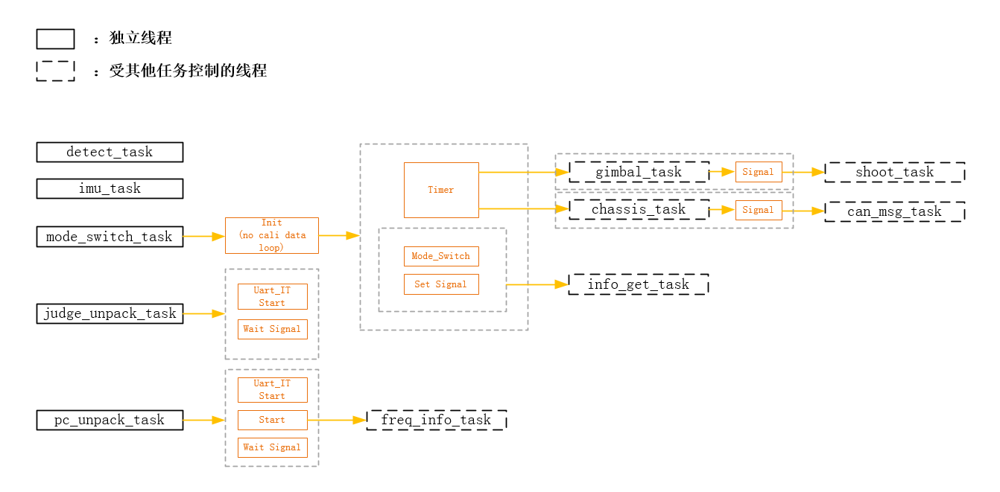
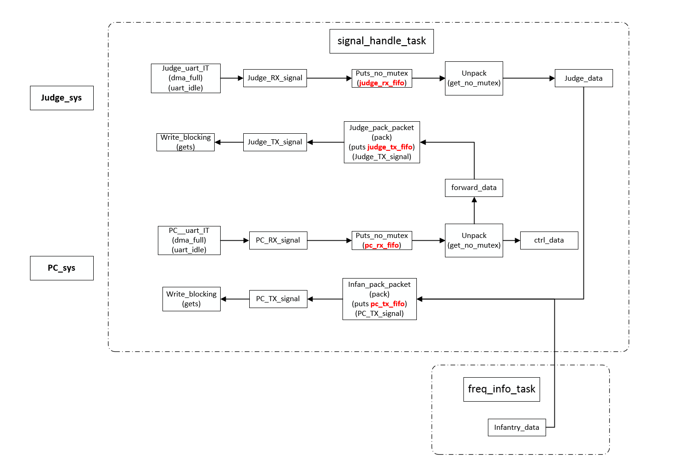
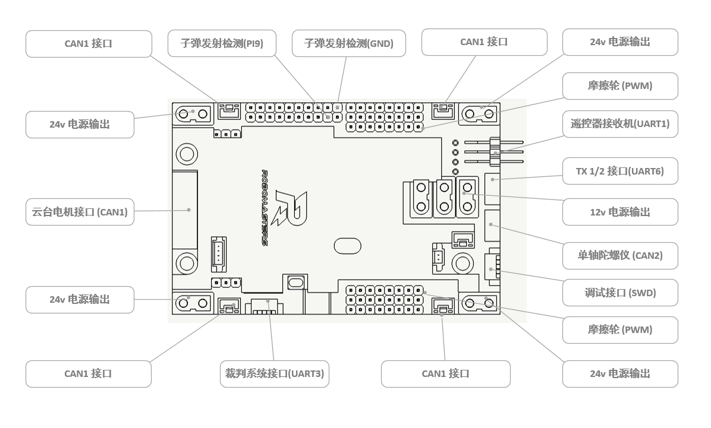

------

[TOC]

------

## 概述

### 程序体系结构

#### 体系框架

1. 使用免费及开源的 freertos 操作系统，兼容其他开源协议 license；
2. 使用标准 CMSIS-RTOS 接口，方便不同操作系统或平台间程序移植；
3. 后期加入 TrueSTUDIO/SW4STM32/makefile 等免费编译环境对应的工程；

#### 内部结构

1. 多任务环境，相比传统步兵控制框架，可以直接实现多线程逻辑，以及阻塞任务；
2. 较为完备的底层上层通信协议，实现上层对步兵各个机构模块的反馈信息获取和控制；
3. 内部程序模式切换、数据、控制各个任务隔离处理，方便添加和裁剪功能；
4. 底盘、云台、发射等机构，内部的控制模式去耦合，便于不同需求控制时的模式切换；

#### 程序框架

1. 基于 HAL 库的 BSP 层，主要提供can、uart、spi、flash、io等板级的配置和通信接口；
2. 数据交互层，这里是程序中会调用 BSP 层函数唯一的地方，主要为应用程序和硬件设备的数据交互；
3. 通信层，负责数据和 uart 硬件间发送和接收，以及这些数据的打包、解析，包含协议部分；
4. 信息获取，交互层可以直接使用的数据、通信层解析好的数据，在这个任务中获取后转化为反馈和控制信息；
5. 模式切换，在不修改控制架构的情况下，实现现有机构功能模式的自定义组合唯一需要修改的地方；
6. 控制任务，3 大机构的控制，包含提供的云台、底盘、射击示例模式 7/6/4 种。

### 软件体系

#### 程序启动时序

各个任务的启动时序图



### 硬件体系

1. 主控 MCU：STM32F427IIHx，配置运行频率180MHz
2. 模块通信方式：CAN；CAN设备：电机电调、陀螺仪模块
3. 上下层通信方式：uart
4. 麦轮安装方式，X型

#### 硬件连接框图


### 协议数据

#### 数据分类

协议数据按照通信方向可以分为两大类：

底层发送给上层的数据：

1. 反馈信息：包含各个机构传感器反馈信息、底层计算出来的一些反馈信息；
2. 底层状态信息：包含底层设备运行状态、底层对上层数据的一些响应等；
3. 转发数据：包含裁判系统的全部信息、服务器端的自定义信息；

底层接收的上层数据：

1. 控制信息：上层对底层 3 个执行机构的控制信息；
2. 配置信息：上层对机器人如轮距、轴距、云台位置等结构配置信息，以及上层程序运行状态，底层响应级别等；
3. 转发数据：需要底层转发给裁判系统，并最终在客户端上显示出来的用户自定义信息；

#### 数据流图



## 快速开始

### 硬件接口

主控板上各个功能接口的位置如下：



### 功能模块

#### 手动模式：

提供遥控器、鼠标键盘模式的基础控制。如果在手动模式下开启一些辅助功能如大符、辅助射击，需要开启上层协议通信，获取上层 PC 的相关数据实现这些功能。

在手动模式下，提供一些上层的 debug 接口，便于上层 PC 程序调试时的测试和验证。

#### 全自动模式：

这种模式下底盘、云台、发射机构受到上层 PC 的完全控制，完全控制包含对这些执行机构以具体物理单位的控制，也包含对这些执行机构的模式切换。

#### 操作档位说明：

##### 手动档

控制数据和 debug 以及自动档隔离（拨杆右上）

遥控器控制：拨杆右上

- 开、关摩擦轮
- 单发、连发射击

鼠标键盘控制：（拨杆左中、右上）

- 开、关摩擦轮
- 单发、连发射击
- 扭腰躲避

##### Debug 档

机器人调试时使用（拨杆右中）

- 扭腰（左上）
- 装甲跟踪，底盘不跟随（左中）
- 装甲跟踪，底盘跟随（左下）
- 摩擦轮继承手动或自动时的状态
- 发弹上层控制

##### 自动档

正常比赛时使用（拨杆右下）

- 全接管（3大机构全部信任上层控制，除非上层出现 fatal_error）


## 工作模式说明

*备注：*

黑体部分为自动模式下能用到的各模块工作模式，PC 端数据发送控制信息时，需要注意模式的初始值。

### 云台

```c
typedef enum
{
  GIMBAL_RELAX         = 0,
  GIMBAL_INIT          = 1,
  GIMBAL_NO_ARTI_INPUT = 2,
  GIMBAL_FOLLOW_ZGYRO  = 3,
  GIMBAL_TRACK_ARMOR   = 4,
  GIMBAL_PATROL_MODE   = 5,
  GIMBAL_SHOOT_BUFF    = 6,
  GIMBAL_POSITION_MODE = 7,
} gimbal_mode_e;
```

| 云台模式                     | 对应功能                        |
| ------------------------ | --------------------------- |
| GIMBAL_RELAX             | 云台断电                        |
| GIMBAL_INIT              | 云台由断电状态回中                   |
| GIMBAL_NO_ARTI_INPUT     | 无手动控制信息输入模式                 |
| GIMBAL_FOLLOW_ZGYRO      | 云台跟随底盘模式                    |
| **GIMBAL_TRACK_ARMOR**   | 云台追踪装甲                      |
| **GIMBAL_PATROL_MODE**   | 巡逻模式，云台 yaw 周期运动，pitch 不受控制 |
| **GIMBAL_SHOOT_BUFF**    | 打大符模式                       |
| **GIMBAL_POSITION_MODE** | 云台位置模式，上层控制角度两轴角度           |

### 底盘

```c
typedef enum
{
  CHASSIS_RELAX          = 0,
  CHASSIS_STOP           = 1,
  MANUAL_SEPARATE_GIMBAL = 2,
  MANUAL_FOLLOW_GIMBAL   = 3,
  DODGE_MODE             = 4,
  AUTO_SEPARATE_GIMBAL   = 5,
  AUTO_FOLLOW_GIMBAL     = 6,
} chassis_mode_e;
```

| 底盘模式                     | 对应功能                 |
| ------------------------ | -------------------- |
| CHASSIS_RELAX            | 底盘断电                 |
| CHASSIS_STOP             | 底盘停止/刹车              |
| MANUAL_SEPARATE_GIMBAL   | 手动模式底盘云台分离           |
| MANUAL_FOLLOW_GIMBAL     | 手动模式底盘跟随云台           |
| **DODGE_MODE**           | 底盘躲避模式，底盘固定旋转，平移不受控制 |
| **AUTO_SEPARATE_GIMBAL** | 底盘和云台分离模式，旋转、平移受上层控制 |
| **AUTO_FOLLOW_GIMBAL**   | 底盘跟随云台，平移受上层控制       |

### 发射机构

```c
typedef enum
{
  SHOT_DISABLE       = 0,
  REMOTE_CTRL_SHOT   = 1,
  KEYBOARD_CTRL_SHOT = 2,
  SEMIAUTO_CTRL_SHOT = 3,
  AUTO_CTRL_SHOT     = 4,
} shoot_mode_e;
```

| 发射机构模式             | 对应功能                 |
| ------------------ | -------------------- |
| SHOT_DISABLE       | 发射机构断电               |
| REMOTE_CTRL_SHOT   | 遥控器控制发射机构            |
| KEYBOARD_CTRL_SHOT | 键盘控制发射机构             |
| SEMIAUTO_CTRL_SHOT | 单发、连发上层控制            |
| **AUTO_CTRL_SHOT** | 摩擦轮开关、速度、单发、连发全部上层控制 |
